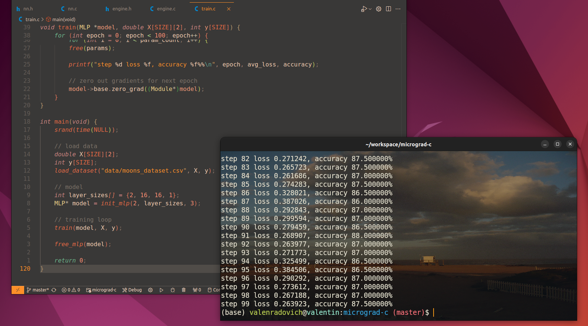
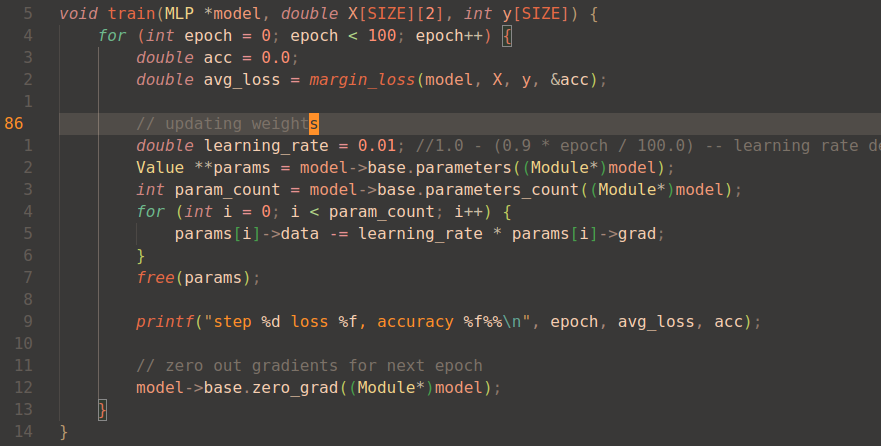

# micrograd in c

inspired from https://github.com/karpathy/micrograd i wrote my own version in c.



auto grad and backprop implementation from scratch, no external dependencies in any part of the code. 

## training

```bash
make
./train
```

